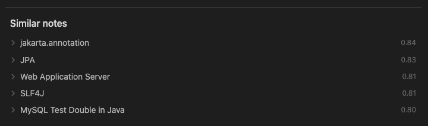

# Similar Notes for Obsidian

Similar Notes is an Obsidian plugin that uses language models to find and recommend semantically similar notes. As shown below, the plugin analyzes your content in real-time and displays the most relevant related notes at the bottom of your current note. This makes it easy to discover connections between your ideas and reference related content while writing.

## Features

-   **Zero External Dependencies**: No need for ChatGPT, Claude, or other external LLM services
-   **Built-in Language Model**: Downloads and runs models directly from Hugging Face
-   **Self-contained**: Includes its own vector database for efficient similarity search
-   **No Local Runner Required**: Unlike solutions that need Ollama or other local services

## How It Works

Similar Notes uses embeddings-based semantic similarity to find connections between your notes that might not be obvious from keywords alone. The plugin understands the meaning behind your content, not just matching specific terms.

As you work on a note, the plugin displays the **5 most semantically similar notes** from your vault at the bottom of your current note. This makes it easy to discover connections and reference related content while writing. Importantly, the plugin intelligently excludes notes that are already linked from your current document, ensuring you only see new potential connections.

## Getting Started

After installing the plugin:

1. **Model Download**: On first run, the plugin will download the default language model. This may take some time depending on your internet connection.
2. **Initial Indexing**: The plugin will automatically begin indexing your existing notes. This process runs in the background.
3. **Progress Monitoring**: Both the model download and indexing progress can be monitored in the status bar in the bottom right corner of the Obsidian window.

Once initialization is complete, the plugin will start suggesting similar notes as you work.

## Model Options

The plugin uses language models to calculate semantic similarity between notes:

-   **Default Model**: `all-MiniLM-L6-v2` - Optimized for English content
-   **Multilingual Model**: `paraphrase-multilingual-MiniLM-L12-v2` - Recommended for non-English users
-   **Custom Models**: You can specify any compatible Sentence Transformer model from Hugging Face

> **Note**: Changing models will trigger re-indexing of all notes, which may take time depending on your vault size.

## Technical Details

Similar Notes leverages several powerful technologies to provide a seamless experience:

-   **Transformers.js**: Uses Hugging Face's transformers.js library, running directly within Obsidian without external dependencies
-   **WebGPU Acceleration**: Utilizes WebGPU for hardware-accelerated model inference when available
-   **Orama Vector Database**: Implements Orama as an efficient vector database for similarity search
-   **Web Workers**: All model operations and vector database queries run in separate Web Workers, ensuring the plugin doesn't impact Obsidian's responsiveness or performance

## License

[MIT](LICENSE)
