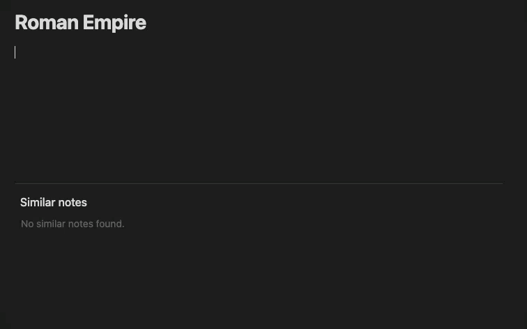
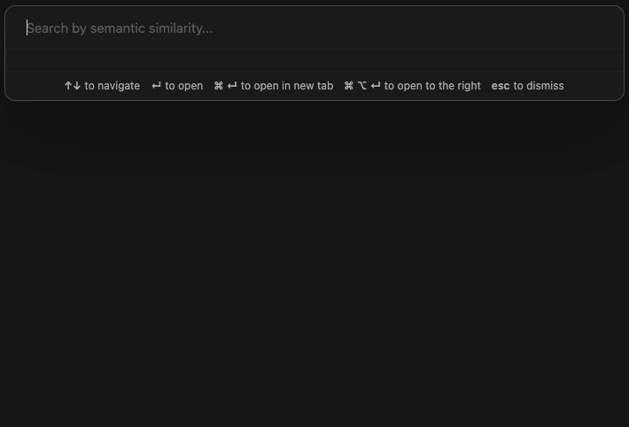

# Similar Notes for Obsidian

Find semantically similar notes using AI. Choose local models for privacy or cloud APIs for flexibility.

### Similar Notes View

As you write, similar notes appear at the bottom of your current note.

### Semantic Search

Press `Cmd+Shift+O` (or `Ctrl+Shift+O`) to search your vault by meaning, not just keywords.

## Features

- **Flexible Options**: Run locally (100% private) or use cloud APIs like OpenAI
- **Mobile & Desktop**: Built-in models work on iOS, Android, and all desktop platforms
- **OpenAI Support**: Use OpenAI embedding models or any OpenAI-compatible API
- **Ollama Support**: Connect to custom models via Ollama (desktop only)
- **No Setup Required**: Built-in models work out of the box, no API keys needed

## Getting Started

1. Install the plugin
2. The default model will download automatically (one-time, ~30MB)
3. Your notes will be indexed in the background
4. Similar notes will appear at the bottom of your current note

Progress appears in the status bar.

## Model Options

### Built-in Models (Mobile & Desktop)

Supports any Sentence Transformer model from Hugging Face. Local processing, no API keys required.

**Recommended:**

- `all-MiniLM-L6-v2` (English, default)
- `paraphrase-multilingual-MiniLM-L12-v2` (multilingual)

> **Mobile note**: Large models may cause crashes due to memory limits. Consider using the default model or OpenAI API on mobile.

### OpenAI / Compatible API

Supports any OpenAI-compatible embedding API.

**Recommended:**

- `text-embedding-3-small`

> **Note for CJK users**: For Chinese, Japanese, and Korean text, multilingual models like `bge-m3` (via Ollama) often outperform OpenAI models in both quality and token efficiency.

### Ollama (Desktop Only)

Supports any Ollama embedding model.

**Recommended:**

- `nomic-embed-text` (English)
- `bge-m3` (multilingual)

## Technical Details

- **Transformers.js**: Runs Hugging Face models directly in Obsidian
- **WebGPU**: GPU acceleration on desktop, automatic CPU fallback
- **Orama**: Built-in vector database for fast search
- **Web Workers**: All processing runs in background threads

## Multi-Device Usage

This plugin stores all data locally in IndexedDB, which is device-specific storage that **does not sync** across devices.

**What this means:**

- Each device maintains its own independent index
- Obsidian Sync, iCloud, Syncthing, or any other file sync tool will **not sync the plugin's data**
- When you open your vault on a new device, the plugin will automatically index your notes from scratch

This is by design - IndexedDB provides fast, reliable local storage that doesn't interfere with vault syncing.

## License

[MIT](LICENSE)
