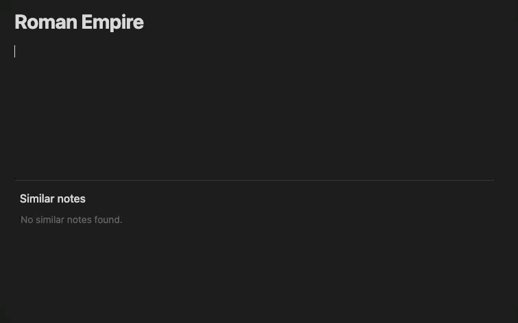
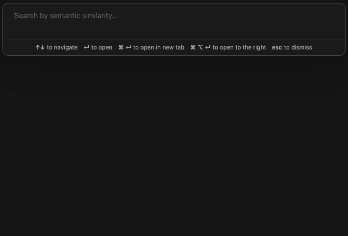

# Similar Notes for Obsidian

[](https://buymeacoffee.com/joybro)

Find semantically similar notes using AI. Choose local models for privacy or cloud APIs for flexibility.

### Similar Notes View

As you write, similar notes appear at the bottom of your current note.



### Semantic Search

Press `Cmd+Shift+O` (or `Ctrl+Shift+O`) to search your vault by meaning, not just keywords.



## Features

- **Flexible Options**: Run locally (100% private) or use cloud APIs like OpenAI
- **Mobile & Desktop**: Built-in models work on iOS, Android, and all desktop platforms
- **OpenAI Support**: Use OpenAI embedding models or any OpenAI-compatible API
- **Ollama Support**: Connect to custom models via Ollama (desktop only)
- **No Setup Required**: Built-in models work out of the box, no API keys needed

## Getting Started

1. Install the plugin
2. The default model will download automatically (one-time, ~30MB)
3. Your notes will be indexed in the background
4. Similar notes will appear at the bottom of your current note

Progress appears in the status bar.

## Model Options

### Built-in Models (Mobile & Desktop)

Supports any Sentence Transformer model from Hugging Face that ships ONNX weights. Local processing, no API keys required.

**Recommended:**

- `all-MiniLM-L6-v2` (English, default)
- `paraphrase-multilingual-MiniLM-L12-v2` (multilingual)

> **Custom models**: The plugin uses Transformers.js, which requires ONNX weights. Many Hugging Face repos only ship PyTorch / safetensors and will fail to load. For other models, look for an ONNX-converted version under the [`onnx-community`](https://huggingface.co/onnx-community) organization, or use the Ollama / OpenAI providers instead.

> **Mobile note**: Large models may cause crashes due to memory limits. Consider using the default model or OpenAI API on mobile.

### OpenAI / Compatible API

Supports any OpenAI-compatible embedding API.

**Recommended:**

- `text-embedding-3-small`

> **Note for CJK users**: For Chinese, Japanese, and Korean text, multilingual models like `bge-m3` (via Ollama) often outperform OpenAI models in both quality and token efficiency.

### Ollama (Desktop Only)

Supports any Ollama embedding model.

**Recommended:**

- `nomic-embed-text` (English)
- `bge-m3` (multilingual)

## Agent Usage

External coding agents can reuse the plugin's similarity search without understanding embeddings or plugin internals:

1. Open a note in Obsidian.
2. Run the command **Similar Notes: Export similar notes for active note**.
3. Read the results from `.obsidian/plugins/similar-notes/agent-similar-notes.json`.

Output format (success):

```json
{
  "version": 1,
  "ok": true,
  "sourcePath": "Projects/My Note.md",
  "generatedAt": "2026-06-09T12:34:56.000Z",
  "results": [
    {
      "path": "Knowledge/Related Note.md",
      "title": "Related Note",
      "score": 0.82,
      "excerpt": "similar content..."
    }
  ]
}
```

On error (e.g. no active markdown file, search failure), the same file is written with `{ "version": 1, "ok": false, "code": "...", "error": "..." }`, where `code` is `NO_ACTIVE_FILE` or `SEARCH_FAILED`.

For driving the command from an agent (CLI flow, validation tips, drop-in skill snippet), see [docs/agent-export.md](docs/agent-export.md).

## Technical Details

- **Transformers.js**: Runs Hugging Face models directly in Obsidian
- **WebGPU**: GPU acceleration on desktop, automatic CPU fallback
- **Orama**: Built-in vector database for fast search
- **Web Workers**: All processing runs in background threads

## Multi-Device Usage

This plugin stores all data locally in IndexedDB, which is device-specific storage that **does not sync** across devices.

**What this means:**

- Each device maintains its own independent index
- Obsidian Sync, iCloud, Syncthing, or any other file sync tool will **not sync the plugin's data**
- When you open your vault on a new device, the plugin will automatically index your notes from scratch

This is by design - IndexedDB provides fast, reliable local storage that doesn't interfere with vault syncing.

## License

[MIT](LICENSE)
